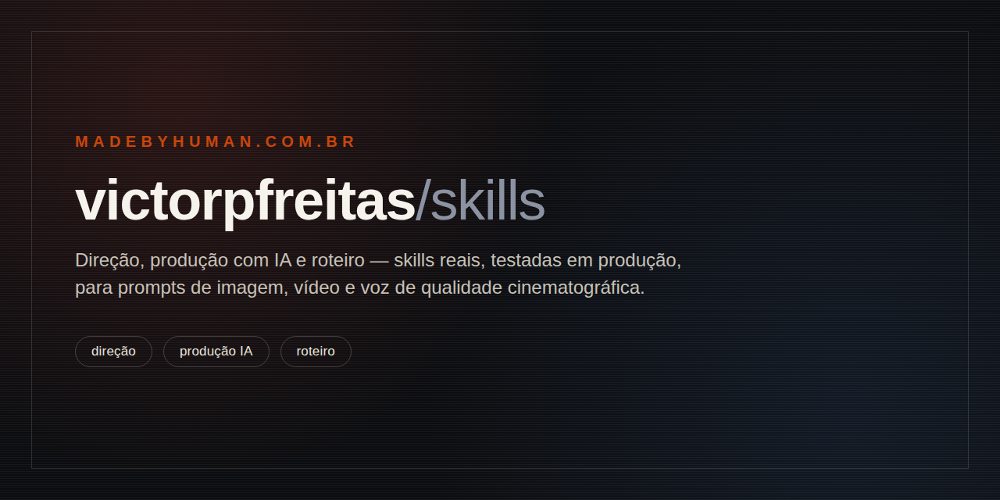

# skills



O método que uso em produção pra dirigir IA generativa: roteiro, cinematografia e voz, condensados em skills reutilizáveis.

## Sumário

- [A ideia](#a-ideia)
- [Skills](#skills)
- [Estrutura do repositório](#estrutura-do-repositório)
- [Como usar](#como-usar)
- [Como cada skill é feita](#como-cada-skill-é-feita)
- [Validar antes de contribuir](#validar-antes-de-contribuir)
- [Licença](#licença)

## A ideia

IA generativa não substitui direção. Ela precisa de alguém guiando o processo: decidindo o enquadramento, o tom do roteiro, a luz da cena, o timbre da voz. Sem direção, um modelo gera conteúdo genérico. Com direção, ele vira ferramenta de produção real.

Este repositório é esse método, aberto. Não são prompts soltos, é o raciocínio de roteirista, diretor de fotografia e produtor que uso todo dia, escrito como skills reutilizáveis. O que está aqui é o que eu de fato uso, não uma versão de vitrine.

Funciona com qualquer agente que suporte skills em Markdown (Claude Code, Codex e outros).

## Skills

| Skill | Categoria | O que faz |
| --- | --- | --- |
| [`diretor-cinematografico`](./direcao/diretor-cinematografico) | Direção | Decupagem, shot list, câmera, lente, luz, cor e blocking. Traduz roteiro em linguagem visual pronta para geração de vídeo com IA. |
| [`image-prompter`](./producao-ia/image-prompter) | Produção IA | Gera prompts cinematográficos de imagem e decide qual modelo usar entre Nano Banana 2, Seedream 5.0 Pro e GPT Image 2. |
| [`seedance-prompter`](./producao-ia/seedance-prompter) | Produção IA | Transforma ideia, cena ou referência visual em prompts de vídeo prontos para o Seedance 2.0. |
| [`elevenlabs-voiceover`](./producao-ia/elevenlabs-voiceover) | Produção IA | Formata roteiro em voice-over com tags emocionais do ElevenLabs Eleven v3, pronto para narração. |
| [`roteirista-interativo`](./roteiro/roteirista-interativo) | Roteiro | Roteirista que constrói roteiro, escaleta ou cena em conjunto, bloco por bloco, perguntando antes de escrever cada parte. |

## Estrutura do repositório

Cada categoria agrupa skills que atuam na mesma etapa da produção. Dentro de cada skill, `SKILL.md` é o ponto de entrada; `references/` só existe quando o assunto não cabe num único arquivo.

```
skills/
  .claude-plugin/marketplace.json      → manifesto do plugin marketplace
  direcao/
    diretor-cinematografico/
      SKILL.md
      references/                      → câmera×emoção, diretores, lentes, micro-beats, por que funciona
  producao-ia/
    image-prompter/
      SKILL.md
      references/                      → um arquivo por modelo: Nano Banana 2, Seedream 5.0 Pro, GPT Image 2
    seedance-prompter/
      SKILL.md
      references/                      → estilo, câmera, ação, áudio, troubleshooting, mecânica do modelo, retake
    elevenlabs-voiceover/
      SKILL.md
      references/                      → mecânica do modelo, troubleshooting
  roteiro/
    roteirista-interativo/
      SKILL.md
      references/                      → personagem, diálogo, worldbuilding, cenários, troubleshooting
```

## Como usar

**No Claude Code**, o repo é também um plugin marketplace: instala uma vez e atualiza sozinho a cada mudança.

```
/plugin marketplace add victorpfreitas/skills
/plugin install victorpfreitas-skills@victorpfreitas
```

Depois de instalado, os skills disparam pelo contexto da conversa (ex.: "monta a decupagem dessa cena", "formata esse roteiro pro elevenlabs"), sem precisar chamar por nome.

**Em qualquer outro agente** (Codex, etc.), basta apontar para a pasta do skill desejado ou colar o conteúdo do `SKILL.md`. São arquivos Markdown puros, sem dependência de nenhuma plataforma.

## Como cada skill é feita

- Cada skill nasce de um caso real de produção, não de teoria solta sobre prompting.
- `references/` só existe quando o `SKILL.md` sozinho ficaria longo demais pra ler de uma vez.
- Todo trigger de skill é testado em conversa real antes de entrar no repo.
- Nada entra aqui sem passar por revisão de dado sensível (cliente, pessoal, interno).
- Um skill sai do repo quando para de refletir como eu realmente trabalho.

## Validar antes de contribuir

Antes de subir qualquer mudança, valide o marketplace e o frontmatter dos skills:

```
claude plugin validate .
```

Todo push e pull request também roda essa validação automaticamente via GitHub Actions (veja `.github/workflows/validate.yml`).

## Licença

MIT. Veja [LICENSE](./LICENSE).

---

Um método de [Victor Freitas](https://madebyhuman.com.br/victor) ([@victorpfreitas](https://x.com/victorpfreitas)), direção criativa com IA na **[Made by Human](https://madebyhuman.com.br/victor)**.
